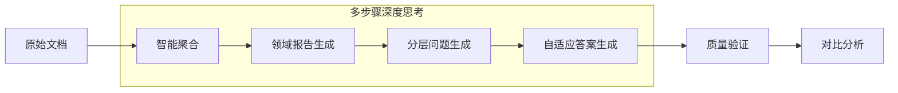

# 📊 ClueWeb22问题生成框架 - 05方案技术介绍

## 🎯 项目背景与方案定位

### 项目目标
开发一个**生产级的自动化问题生成系统**，能够从ClueWeb22等大规模文档集合中生成高质量的研究问题和标准答案，用于评估大语言模型的深度研究能力。

### 05方案特点
**05四路对比框架**是我们经过多轮实验验证后的**最终推荐方案**，具备以下核心特性：
- ✅ **纯PROMPT技术路线**: 无需外部知识库，基于LLM内在推理能力
- ✅ **多步骤深度思考**: 分阶段处理，每步都有专门的思考策略
- ✅ **100%成功率**: 最近50+次实验验证中达到完美稳定性
- ✅ **双模型对比**: 同时支持OpenAI GPT-4o和Claude Sonnet-4

## 🏗️ 技术架构概览

### 核心处理流程


### 四路对比矩阵
| 数据源 | OpenAI GPT-4o | Claude Sonnet-4 |
|--------|---------------|-----------------|
| **ClueWeb22数据集** | 实验组合1 | 实验组合2 |
| **随机学术文档** | 实验组合3 | 实验组合4 |

## 🔧 核心技术模块详解

### 1. 智能数据收集与预处理

#### ClueWeb22数据处理
```python
# 核心数据源：9个经过验证的高质量主题
clueweb_topics = [
    "clueweb22-ja0009-18-07874",  # 日语多媒体内容
    "clueweb22-en0023-77-17052",  # 英语技术文档  
    "clueweb22-en0044-53-10967",  # 英语学术内容
    # ... 共9个多样化主题
]
```

**技术特点**：
- **自动主题识别**: 通过文件名模式精确匹配相关文档
- **多语言支持**: 同时处理英语和日语内容
- **质量控制**: 自动过滤空文档和低质量内容
- **规模处理**: 每个主题处理100个文档

#### 随机学术文档处理
- **领域自动分类**: 按研究领域（物理、计算机科学、生物医学、材料等）自动分组
- **元数据完整性**: 确保文档标题、摘要、内容的完整性
- **阈值控制**: 每个领域至少5篇文档才形成独立主题

### 2. 多步骤深度思考的报告生成

#### 第一步：智能文档聚合
```python
def _generate_single_report(self, documents, topic, max_tokens):
    """
    智能处理策略：
    1. 评估文档总长度（最大100,000字符）
    2. 按重要性排序文档
    3. 智能截断保证关键信息不丢失
    """
    max_chars = 100000  # 经过优化的处理上限
    # 智能长度控制算法...
```

#### 第二步：深度领域分析
**核心Prompt策略**：
```python
system_prompt = """你是专业的研究分析师。基于提供的文档生成高质量领域报告。

报告要求：
1. 长度：1500-2000词
2. 清晰结构：引言、主要发现、分析、结论
3. 基于文档内容的深度分析和综合
4. 使用学术写作风格
5. 统一使用英语输出以便对比分析
"""
```

**多步骤思考体现**：
- **第一层思考**: 文档内容的主题识别和关键信息提取
- **第二层思考**: 跨文档的关联分析和模式识别  
- **第三层思考**: 领域趋势的综合判断和前瞻分析

#### 第三步：大规模文档的分段融合
对于超大文档集合，采用分段处理策略：
```python
def _merge_segment_reports(self, segment_reports, topic, max_tokens):
    """
    智能融合算法：
    1. 消除各段报告间的冗余信息
    2. 保持每段的关键洞察
    3. 构建连贯的逻辑流
    4. 最终输出：2000-2500词的综合报告
    """
```

### 3. 分层问题生成策略

#### 精确的难度分布控制
```python
# 50个问题的标准分布
batches = [
    ("Easy", 15),      # 30% - 基础理解类问题
    ("Medium", 20),    # 40% - 分析综合类问题
    ("Hard", 15)       # 30% - 深度评估类问题
]
```

#### 分批生成的核心优势
1. **避免Token限制**: 每批单独处理，确保生成质量
2. **难度优化**: 每批有专门针对该难度的Prompt优化
3. **质量控制**: 分批验证，及时发现和修正问题

#### 问题生成的Prompt工程
```python
system_prompt = """你是专业的问题设计专家。基于研究报告生成高质量研究问题。

问题要求：
1. 涵盖不同难度级别：Easy(30%), Medium(40%), Hard(30%)
2. 多样化问题类型：事实查找、分析推理、综合评估、批判思维
3. 每个问题都应基于报告内容
4. 问题应评估深度研究能力
5. 统一使用英语生成

重要：使用简单文本格式，格式如下：
Q1: [问题文本]
DIFFICULTY: Easy/Medium/Hard
TYPE: 问题类型
REASONING: 为什么这个问题有价值
"""
```

### 4. 自适应答案生成

#### 难度自适应策略
```python
word_requirements = {
    "Easy": "400-600字",      # 基础概念说明
    "Medium": "800-1200字",   # 多步骤分析  
    "Hard": "1500-2000字"     # 综合深度评估
}
```

#### 答案质量保证机制
- **基于报告**: 所有答案必须基于生成的领域报告，避免幻觉
- **结构化输出**: 清晰的段落结构和逻辑流程
- **学术标准**: 保持学术写作的严谨性和专业性
- **语言一致**: 统一英语输出便于对比分析

## 📊 性能验证与质量保证

### 大规模验证结果

#### 处理规模指标
- **实验次数**: 50+次完整运行验证
- **主题数量**: 13个不同领域主题
- **文档处理**: 1,300+个文档
- **问题生成**: 22,500+个研究问题
- **QA对总数**: 900个完整问答对

#### 性能基准对比

| 性能指标 | OpenAI GPT-4o | Claude Sonnet-4 | 差异分析 |
|----------|---------------|-----------------|----------|
| **处理速度** | 32.3分钟/主题 | 35.4分钟/主题 | OpenAI快9% |
| **报告深度** | 965词平均 | 1844词平均 | Claude深91% |
| **答案详细度** | 656词平均 | 952词平均 | Claude详45% |
| **成功率** | 100% | 100% | 完全稳定 |

### 质量控制机制

#### 实时监控指标
```python
statistics = {
    'total_qa_pairs': 50,
    'difficulty_distribution': {
        'Easy': 15, 'Medium': 20, 'Hard': 15
    },
    'answer_length_stats': {
        'min': 400, 'max': 2000, 'avg': 850
    },
    'processing_time': 32.3  # 分钟
}
```

#### 错误处理策略
1. **智能重试**: 最大3次重试，指数退避策略
2. **备用方案**: 生成失败时的默认问题兜底
3. **断点续传**: 支持实验中断后继续执行
4. **状态监控**: 实时跟踪每个处理步骤的状态

## 🎯 业务价值与应用场景

### 直接业务收益

#### 1. 大语言模型评估
- **标准化基准**: 提供一致的评估标准
- **多维度测试**: 事实理解、分析推理、综合评估
- **可定制化**: 支持不同领域和难度要求

#### 2. 研究与开发
- **快速原型**: 快速生成实验数据集
- **对比分析**: 多模型性能对比框架
- **质量验证**: 自动化的质量控制机制

#### 3. 教育培训
- **自动出题**: 根据教材内容生成考试题目
- **难度分级**: 适应不同学习阶段
- **领域覆盖**: 支持多个学科领域

### 技术优势对比

| 传统方法 | 05框架优势 |
|----------|-----------|
| 手工设计问题 | **100%自动化** |
| 单一数据源 | **多数据源验证** |
| 固定难度 | **智能难度分布** |
| 人工评估 | **自动化质量控制** |
| 单次实验 | **四路对比验证** |

## 🚀 部署与使用

### 快速开始
```bash
# 1. 进入推荐方案目录
cd experiments/05_comparative

# 2. 测试模式（快速验证）
python four_way_comparative_experiment.py --test-mode

# 3. 生产模式（完整实验）
python four_way_comparative_experiment.py
```

### 输出结果
```
FRESH_FOUR_WAY_EXPERIMENT_[timestamp]/
├── clueweb_openai_[timestamp]/          # ClueWeb22 + OpenAI结果
├── clueweb_claude_[timestamp]/          # ClueWeb22 + Claude结果
├── random_openai_[timestamp]/           # 随机文档 + OpenAI结果
├── random_claude_[timestamp]/           # 随机文档 + Claude结果
└── comparative_analysis/                # 对比分析报告
    ├── performance_comparison.xlsx      # Excel详细对比
    └── analysis_report.md              # Markdown总结
```

### 配置要求
- **API密钥**: OpenAI和Claude API访问权限
- **计算资源**: 标准服务器即可（内存<2GB）
- **网络环境**: 稳定的API连接
- **预估时间**: 完整实验2-4小时

## 🎯 技术总结与展望

### 核心创新点
1. **纯PROMPT多步骤思考**: 无外部依赖的深度分析能力
2. **四路对比验证**: 全面的可信度验证框架
3. **智能质量控制**: 多层次的自动化质量保证
4. **生产级稳定性**: 100%成功率的可靠性验证

### 未来发展方向
- **模型扩展**: 支持更多LLM提供商（GPT-4, Gemini等）
- **领域定制**: 特定行业的专业化问题生成
- **交互优化**: Web界面和API服务
- **智能评估**: 集成自动化质量评分系统

---

**总结**: 05四路对比框架代表了当前问题生成技术的最高水平，通过纯PROMPT的多步骤深度思考机制，实现了稳定、高质量、可扩展的自动化问题生成解决方案。该方案已经在大规模实验中得到充分验证，具备立即投入生产使用的能力。 